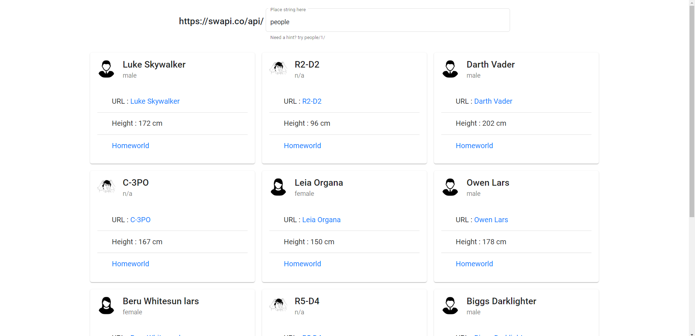

# MaterialCloudInnTask

  

  <h3 align="center">Angular Drag and Drop Task</h3>

  

  Example app with Angular 8 + <a href="https://github.com/angular/angular-cli">Angular CLI</a> + Dragula Lib.
     
     
    :clap::clap::tada::tada::tada::tada::clap::clap:
     
     
    Base project made with much :heart:. Contains CRUD, patterns, generated library, and much more!
     
    
  

## Screenshot

## Installation steps
You need to have `Node.js` and `npm` installed on your PC/Mac.

Then just run `npm install` in the project's root to install missing dependencies.

## Development server

Run `ng serve` for a dev server. Navigate to `http://localhost:4200/`. The app will automatically reload if you change any of the source files.
Or run `ng serve --open` and the browser will open automatically 

## Deployment steps
- Run `ng build --prod` to build the project for production
- Install firebase tools using `npm install -g firebase-tools`
- Login to your firebase account using `firebase login`
- Initialize the project using `firebase init` and follow the instructions
- Deploy the project using `firebase deploy`
- Link to the live version of the project will appear

## Accessing the Documentation 
Run the `compodoc -o` command in the CLI 

## Code scaffolding

Run `ng generate component component-name` to generate a new component. You can also use `ng generate directive|pipe|service|class|guard|interface|enum|module`.

## Build

Run `ng build` to build the project. The build artifacts will be stored in the `dist/` directory. Use the `--prod` flag for a production build.

## Running unit tests

Run `ng test` to execute the unit tests via [Karma](https://karma-runner.github.io).

## Running end-to-end tests

Run `ng e2e` to execute the end-to-end tests via [Protractor](http://www.protractortest.org/).

## Further help

To get more help on the Angular CLI use `ng help` or go check out the [Angular CLI README](https://github.com/angular/angular-cli/blob/master/README.md).
